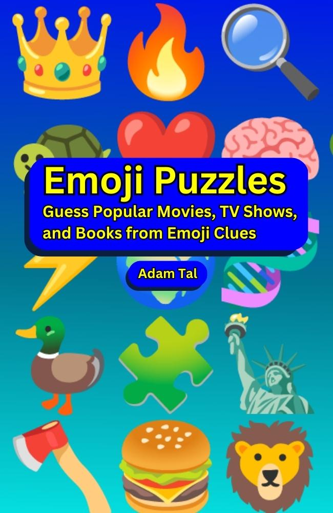

# Emoji Puzzles

👋 Welcome!

I used this repository to make my book **Emoji Puzzles**, now available on Amazon in [ebook](https://www.amazon.com/dp/B0BZZ7S6JQ) and [paperback](https://www.amazon.com/dp/B0BZFP394J).

Here, you can access the tools I used to have AI generate both the puzzles and the code that converted them into the final manuscripts.

Feel free to use this as a resource for creating your own books! Be sure to check back for updates, as I'll continue to add new content for some time. 😊

Looking forward to connecting with you and exploring more ways to apply AI in our lives! 💡

https://emojipuzzlebook.com/

<a href="https://www.amazon.com/dp/B0BZZ7S6JQ">
  
<a/>

## How to Generate an Emoji Puzzle Book

Before starting, take a look at the example [ebook](output/generated_manuscripts/2023-03-29-06-37-AM/generated-ebook.pdf) and [paperback](output/generated_manuscripts/2023-03-29-06-37-AM/generated-paperback.pdf). This is the final output you'll be working towards.

This project is written in [Python](https://www.python.org/), but don't worry, you won't need to know Python to use it.

To follow these instructions, you'll need to be familiar with your computer's Command Line Interface. If you're completely new to this, [here's a beginner-friendly guide](https://www.codecademy.com/learn/learn-the-command-line) that can help you learn the basics.

### Setup & Install Dependencies

First, download this repo, [here's a good guide to get up to speed on git](http://rogerdudler.github.io/git-guide/).

```commandline
git clone https://github.com/AdmTal/emoji-puzzles.git
cd emoji-puzzles
```

This repo has [emoji-data](https://github.com/iamcal/emoji-data) installed as a submodule.

You will need to download that in order to be able to generate emoji puzzle books.

This downloads ~4GB of emoji files, so it might take a little while 😅.

```commandline
git submodule update --init
```

Then, install the required Python dependencies.

```commandline
python3 -m virtualenv venv
source venv/bin/activate
pip install -r requirements.txt
```

### Generate an Emoji Puzzle Book

Run these commands. They each generate and then open a [PDF file](https://www.adobe.com/acrobat/about-adobe-pdf.html).

```commandline
python src/generate_book.py --layout ebook
python src/generate_book.py --layout paperback
```

The [generate_book.py](src/generate_book.py) script picks the [latest set of puzzle files](output/generated_puzzles/2023-03-29-06-37-AM), and converts them into a book.

The repo comes preloaded with [2 movies](inputs/movies.csv), [2 TV shows](inputs/tv_shows.csv), and [2 books](inputs/books.csv), and that's why you see that content in the books you just generated.

### How to Choose Your Own Movies, TV Shows, and Books

Interested in making emoji puzzles for **your own favorite** Movies, TV Shows, and Books?

Each puzzle is defined in a [JSON file](https://developer.mozilla.org/en-US/docs/Learn/JavaScript/Objects/JSON#no_really_what_is_json). Take a look at the file example for [The Very Hungry Catapillar](output/generated_puzzles/2023-03-29-06-37-AM/books/the-very-hungry-caterpillar.json).

To create a puzzle, simply create a puzzle file for it and place in one of the [puzzle folders](output/generated_puzzles/2023-03-29-06-37-AM)

You can ✍️ write these files yourself, or you can use AI 🤖.

### Generate Puzzles on Poe

If you sign up on [poe.com](https://poe.com/), you can [access my chatbot](https://poe.com/EmojiPuzzles) which is already "prompt engineered" to generate valid puzzle files.

All you'll need to do is give it a title.

### How to Prompt the AI

[This is the main prompt I used for this project](src/prompts.py).

Try copying and pasting that into ChatGPT (or any other currently available AI you want to try).

On this project, I used a mix of [ChatGPT](https://chat.openai.com/chat), [OpenAI's Playground](https://platform.openai.com/playground), and [OpenAI's API](https://platform.openai.com/docs/api-reference).

The next section covers how to use the latter to generate puzzles in bulk.

### Generating Puzzles with GPT-4

You'll need access to OpenAI's REST API to generate puzzles.

Sign up for an account at https://openai.com/.

Follow [their documentation](https://platform.openai.com/docs/api-reference) to provision your own API credentials.

Heads up, OpenAI charges for API usage, so make sure you go to your [Settings](https://platform.openai.com/account/usage) to keep tabs on how much you are spending. I recommend you set up a **hard limit** under [billing settings](https://platform.openai.com/account/billing/limits) to avoid any surprises.

Save your API credentials into OS Environment Variables and run the [generation script](src/generate_emoji_puzzles.py):

```commandline
export OPENAI_API_ORG=add-your-org-id-here
export OPENAI_API_KEY=add-your-api-secret-key-here
python src/generate_emoji_puzzles.py
```

The [generate_emoji_puzzles](src/generate_emoji_puzzles.py) script will create emoji puzzles for the titles listed in the [inputs folder](inputs).

That folder is filled with CSV files. You can simply add or remove titles and rerun the above generation script.

You can then rerun the [generate_book script](src/generate_book.py). That file always uses your latest generated files unless you specify the input path like so:

```commandline
python src/generate_book.py --layout ebook --input 2023-03-29-06-37-AM
```

### Fixing Errors

GPT-4 is pretty smart, but it might still generate invalid JSON from time to time.

Run this command to double-check that all puzzle files are formatted correctly:

```commandline
python src/validate_puzzle_files.py
```

That script will let you know if any of the JSON objects are invalid, or missing required keys.

For example, sometimes GPT-4 might use `"release-years": "1986-1990"` instead of the required format `"release_year": "1986"`.

I recommend fixing these errors manually.  Copy and paste the file contents into this [online JSON validator](https://jsonlint.com/), and keep running the above script until the puzzles are error free.

### Editing and Revising the Generated Emoji Puzzles

GPT-4 does an impressive job at generating emoji puzzles, but it's not perfect. Sometimes, you might find that the generated emojis aren't quite hitting the mark or that they contain incorrect details about the movie, TV show, or book. In such cases, you can use the following addendum to your prompt to request iterative improvements from the AI:

> The user might respond with feedback asking for iterative improvements. Take their feedback into account, and send back updated EMOJI only. When the user confirms they are happy, then you can respond with the full JSON for that final set of EMOJI.

This will let you interact with GPT-4 (or another AI model) to ask for edits and revisions to the generated emoji puzzles. Once you're satisfied with the updated emoji set, you can then receive the final JSON and update your puzzle file. This process ensures that your emoji puzzles are as accurate and engaging as possible.
